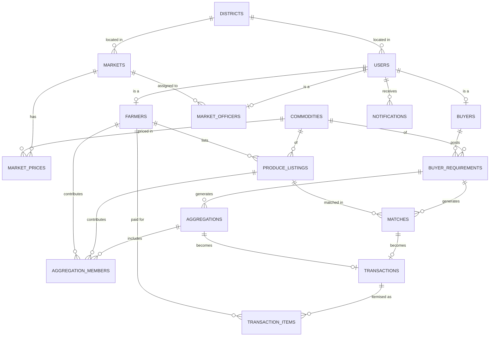
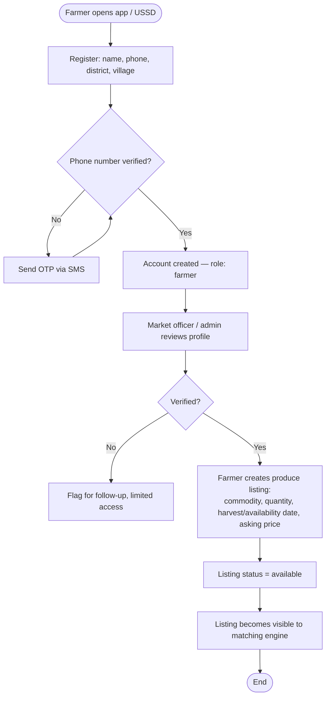
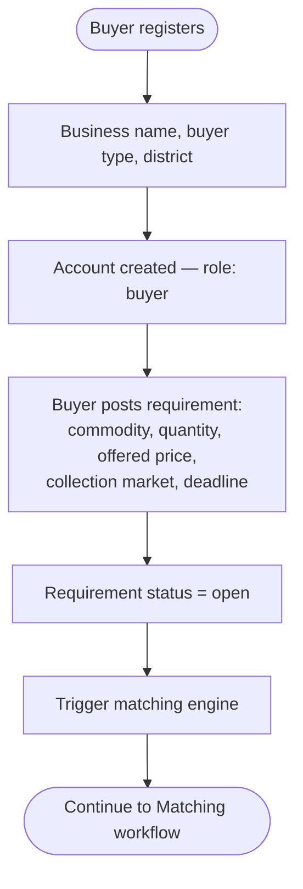
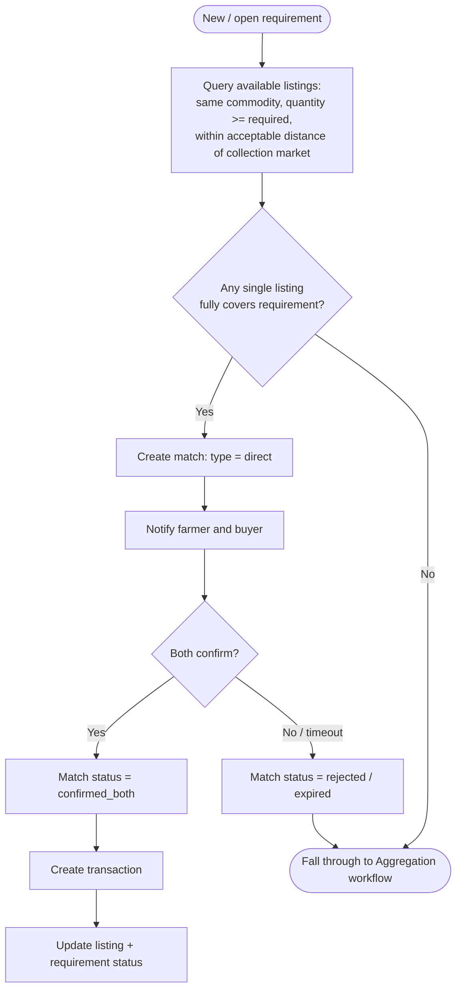
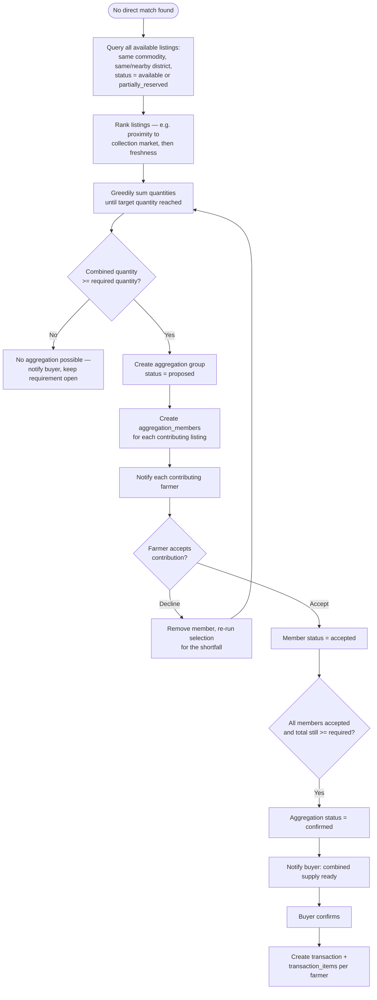
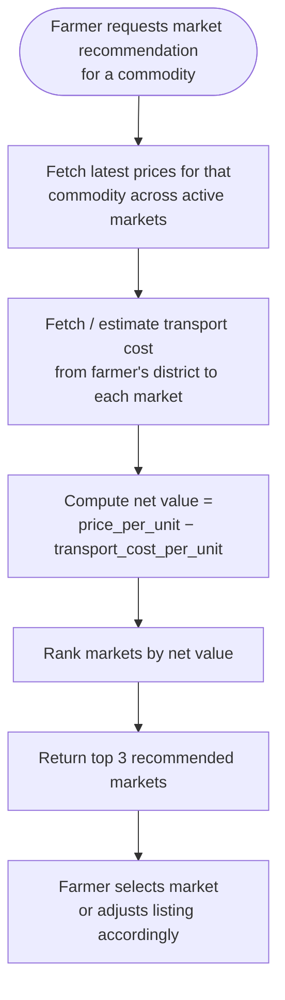
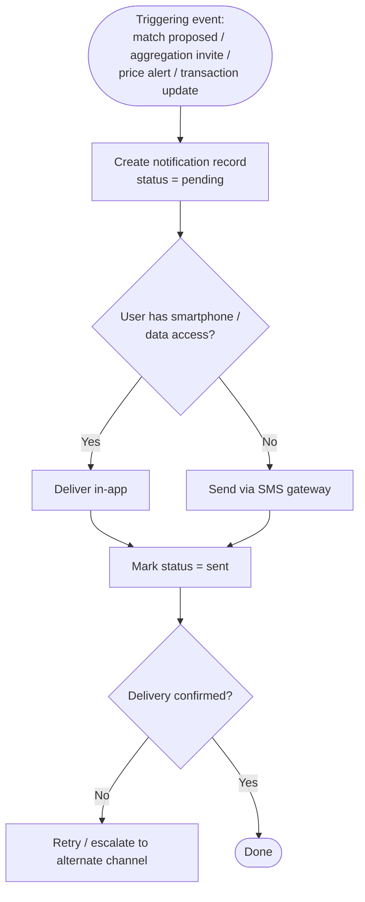

# AgriLink Uganda — Workflows & Database Design

Reference diagrams for the team. These render natively on GitHub (no plugins needed) since they use fenced ```mermaid blocks. Pair with [`schema.sql`](./schema.sql) for the full DDL.

## Table of Contents
- [Entity Relationship Diagram](#entity-relationship-diagram)
- [1. Farmer Registration & Produce Listing](#1-farmer-registration--produce-listing)
- [2. Buyer Registration & Requirement Posting](#2-buyer-registration--requirement-posting)
- [3. Automated Matching (Direct)](#3-automated-matching-direct)
- [4. Produce Aggregation](#4-produce-aggregation)
- [5. Market Price Comparison & Recommendation](#5-market-price-comparison--recommendation)
- [6. Notifications & Alerts](#6-notifications--alerts)

---

## Entity Relationship Diagram

Fifteen tables covering users/role profiles, market intelligence, supply and demand, matching, aggregation, transactions and notifications.



---

## 1. Farmer Registration & Produce Listing

A farmer joins the platform, gets verified, and declares available or expected produce that becomes visible supply for matching.



---

## 2. Buyer Registration & Requirement Posting

A buyer registers, then posts a commodity requirement that immediately triggers a search for matching supply.



---

## 3. Automated Matching (Direct)

The rule-based engine looks for a single farmer listing that can satisfy a requirement on its own before considering aggregation.



---

## 4. Produce Aggregation

When no single farmer can meet a requirement, the engine combines compatible quantities from nearby farmers into one proposed supply group.



---

## 5. Market Price Comparison & Recommendation

Helps a farmer decide where to sell by weighing price against estimated transport cost, not price alone.



---

## 6. Notifications & Alerts

A single dispatch path so any event in the system (match, aggregation invite, price change) reaches the right user on the right channel.


